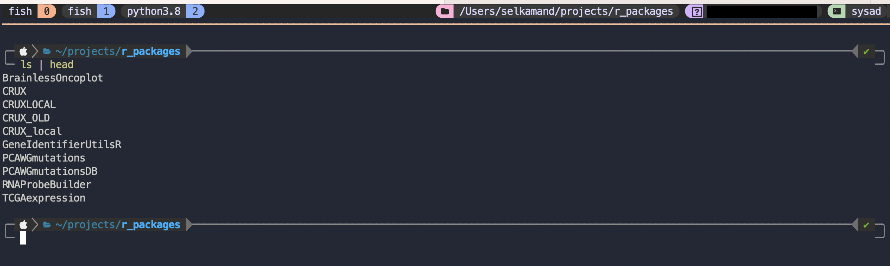

## Config

This repo seeks to speed up setup time on new devices by consolidating 
configuration files for applications like tmux, rstudio, fish, etc all in the one place


## Instructions

### Setup Terminal

End goal is a terminal that looks roughly like this:



1. Install [Alacritty](https://github.com/alacritty/alacritty?tab=readme-ov-file). Mac default terminal isn't bad either.
2. (on mac) Install [homebrew](https://brew.sh/)
3. `brew install fish` and set to default shell.
4. Set default shell
   ```
   echo /opt/homebrew/bin/fish | sudo tee -a /etc/shells
   chsh -s /opt/homebrew/bin/fish
   ```
6. Install [fisher](https://github.com/jorgebucaran/fisher) for fish plugin management
7. Install [tide](https://github.com/IlanCosman/tide) for a prettier prompt (don't forget to install the Nerd fonts as described on the bottom of the github readme)
8. If using alacritty `mkdir -p ~/.config/alacritty; cp config/alacritty.toml ~/.config/alacritty`
9. Install [radian](https://github.com/randy3k/radian) for a better R terminal.
10. If using radian `mkdir -p ~/.config/radian; cp config/radian/profile ~/.config/radian/profile` to get keyboard shortcuts for common package development commands (e.g. escape+l provides `devtools::load_all()`)

#### Terminal Multiplexing (TMUX)
6. Install tmux for terminal multiplexing (`brew install tmux`)
7. Install [tmux plugin manager](https://github.com/tmux-plugins/tpm)
8. Copy `config/.tmux.conf` to `~/.tmux.conf`
9. `Ctrl-b + r` to reload tmux conf then `Ctrl-b + I` to install plugins


### Core Scripts

I usually like having a folder of `~/scripts` added to my path
```
#Add custom path to path
set -U fish_user_paths (realpath ~/scripts) $fish_user_paths
```

For scripts to add see: 
[assorted_bash_utils](https://github.com/selkamand/assorted_bash_utils)


### Aliases

On linux, to replicate pbcopy/pbaste commands use the following aliases
```
alias pbcopy 'xclip -selection clipboard'
alias pbpaste 'xclip -selection clipboard -o'
funcsave pbcopy
funcsave pbpaste
```

On most platforms, you'll need to make ls colourful
```
alias ls 'ls -G'
funcsave ls
```

and define ll (longlist) yourself
```
alias ll 'ls -lh'
funcsave ll
```


### Most important basic software installs

All of the following can be installed from brew
```
# Utilities
aria2 # fast downloads
htop # better top
parallel # parallelization utility

# Bioinformatics sofware
htslib  
samtools 
bcftools

## Containerisation / Virtualisation
docker
lazydocker # Terminal Interface for docker management

# Dependency Managers
micromamba # Complete conda rewrite in C++ for speed - no python dep :)
lmod # Dependency manager
```

Install this software all at once using
```
cat config/brew_software_list.txt | grep "^[a-zA-Z]" | cut -f1 -d ' ' | xargs -n 1 brew install
```

## Languages

### Java
1. Install [SDKman for fish](https://github.com/reitzig/sdkman-for-fish)
2. `sdk install java`

### R

1. Install [R and Rstudio](https://posit.co/download/rstudio-desktop/)
2. Copy `config/.Rprofile` to `~/.Rprofile` so new packages have the right author info. If you're not the owner of this repo, either skip this or change .Rprofile to your information)
3. In Rstudio, edit snippets - than replace all with content from `r.snippets`

Can use Rswitch to manage multiple R installs / renv for R package virtual environments.


### Rust
Install [rust](https://www.rust-lang.org/tools/install) 

### Python

My preferred way to manage python is [pyenv](https://github.com/pyenv/pyenv) (`brew install pyenv`)

## GUI software
* VScode for rust/python/js/bash dev.


### More software you can't install from brew

1. [Nextflow](https://www.nextflow.io/docs/latest/install.html)

### Lmod setup
See brew lmod page for initialisation instructions for fish. 

Then set MODULEPATH variable as follows
```
mkdir -p ~/tools/modulefiles/
set -Ux MODULEPATH (realpath ~/tools/modulefiles/)     
```
